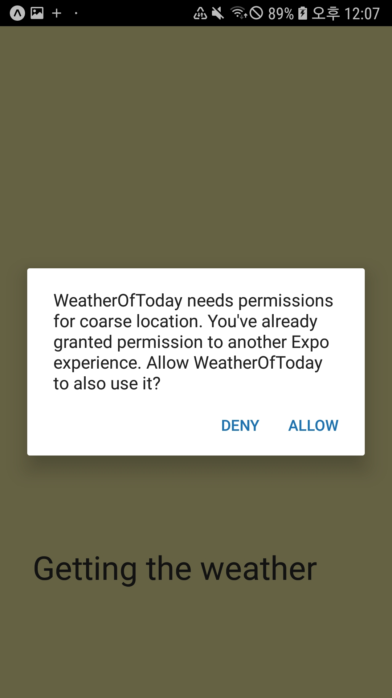
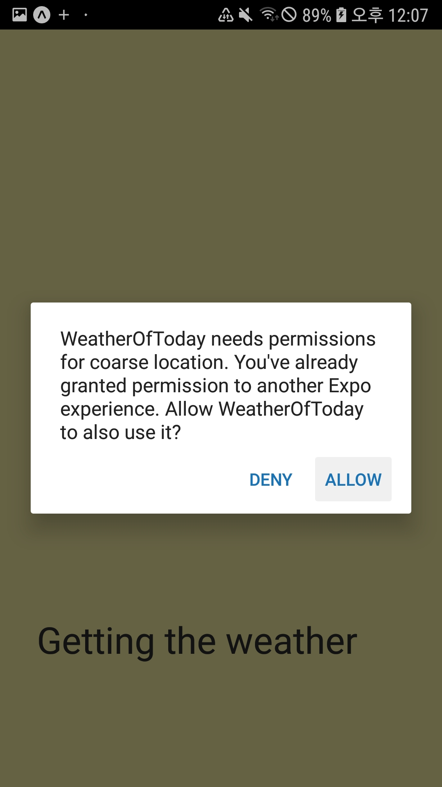

# WeatherOfToday_Application using #React Native
### Including
- API (about the weather information)
- node
- npm
- expo CLI (***for test***)
- Android Studio

### You can get information about the weather of today.
### It will be published soon.

